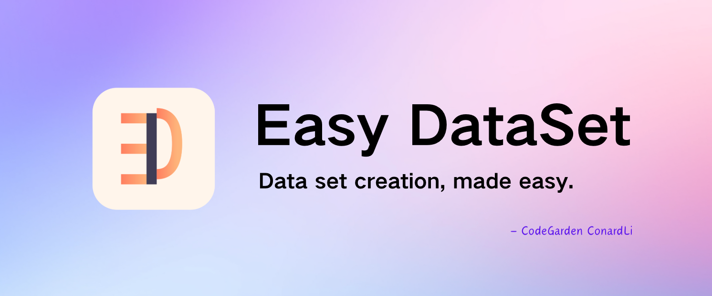

<div align="center">




**一个强大的大型语言模型微调数据集创建工具**

[简体中文](./README.zh-CN.md) | [English](./README.md)

[功能特点](#功能特点) • [快速开始](#快速开始) • [使用方法](#使用方法) • [文档](#文档) • [贡献](#贡献) • [许可证](#许可证)

</div>

## 概述

Easy Dataset 是一个专为创建大型语言模型（LLM）微调数据集而设计的应用程序。它提供了直观的界面，用于上传特定领域的文件，智能分割内容，生成问题，并为模型微调生成高质量的训练数据。

通过 Easy Dataset，您可以将领域知识转化为结构化数据集，兼容所有遵循 OpenAI 格式的 LLM API，使微调过程变得简单高效。


## 功能特点

- **智能文档处理**：上传 Markdown 文件并自动将其分割为有意义的片段
- **智能问题生成**：从每个文本片段中提取相关问题
- **答案生成**：使用 LLM API 为每个问题生成全面的答案
- **灵活编辑**：在流程的任何阶段编辑问题、答案和数据集
- **多种导出格式**：以各种格式（Alpaca、ShareGPT）和文件类型（JSON、JSONL）导出数据集
- **广泛的模型支持**：兼容所有遵循 OpenAI 格式的 LLM API
- **用户友好界面**：为技术和非技术用户设计的直观 UI
- **自定义系统提示**：添加自定义系统提示以引导模型响应

## 本地运行


### 使用 NPM 安装

1. 克隆仓库：
   ```bash
   git clone https://github.com/ConardLi/easy-dataset.git
   cd easy-dataset
   ```

2. 安装依赖：
   ```bash
   npm install
   ```

3. 启动开发服务器：
   ```bash
   npm run build

   npm run start
   ```

4. 打开浏览器并访问 `http://localhost:3000`

### 使用 Docker

1. 拉取镜像：
   ```bash
   docker pull conardli17/easy-dataset:latest
   ```

2. 运行容器：
   ```bash
   docker run -d -p 3000:3000 -v /path/to/local-db:/app/local-db --name easy-dataset conardli17/easy-dataset:latest
   ```

3. 打开浏览器并访问 `http://localhost:3000`

## 使用方法

### 创建项目

1. 在首页点击"创建项目"按钮
2. 输入项目名称和描述
3. 配置您首选的 LLM API 设置

### 处理文档

1. 在"文本分割"部分上传您的 Markdown 文件
2. 查看自动分割的文本片段
3. 根据需要调整分段

### 生成问题

1. 导航到"问题"部分
2. 选择要从中生成问题的文本片段
3. 查看并编辑生成的问题
4. 使用标签树组织问题

### 创建数据集

1. 转到"数据集"部分
2. 选择要包含在数据集中的问题
3. 使用配置的 LLM 生成答案
4. 查看并编辑生成的答案

### 导出数据集

1. 在数据集部分点击"导出"按钮
2. 选择您喜欢的格式（Alpaca 或 ShareGPT）
3. 选择文件格式（JSON 或 JSONL）
4. 根据需要添加自定义系统提示
5. 导出您的数据集

## 项目结构

```
easy-dataset/
├── app/                      # Next.js 应用目录
│   ├── api/                  # API 路由
│   │   └── projects/         # 项目相关 API
│   ├── projects/             # 项目相关页面
│   │   ├── [projectId]/      # 项目详情页面
│   └── page.js               # 主页
├── components/               # React 组件
│   ├── home/                 # 主页相关组件
│   │   ├── HeroSection.js
│   │   ├── ProjectList.js
│   │   └── StatsCard.js
│   ├── Navbar.js             # 导航栏组件
│   └── CreateProjectDialog.js
├── lib/                      # 工具库
│   └── db/                   # 数据库模块
│       ├── base.js           # 基础工具函数
│       ├── projects.js       # 项目管理
│       ├── texts.js          # 文本处理
│       ├── datasets.js       # 数据集管理
│       └── index.js          # 模块导出
├── styles/                   # 样式文件
│   └── home.js               # 主页样式
└── local-db/                 # 本地数据库目录
```

## 文档

有关所有功能和 API 的详细文档，请访问我们的[文档站点](https://github.com/ConardLi/easy-dataset/wiki)。

## 贡献

我们欢迎社区的贡献！如果您想为 Easy Dataset 做出贡献，请按照以下步骤操作：

1. Fork 仓库
2. 创建新分支（`git checkout -b feature/amazing-feature`）
3. 进行更改
4. 提交更改（`git commit -m '添加一些惊人的功能'`）
5. 推送到分支（`git push origin feature/amazing-feature`）
6. 打开 Pull Request

请确保适当更新测试并遵守现有的编码风格。

## 许可证

本项目采用 Apache License 2.0 许可证 - 有关详细信息，请参阅 [LICENSE](LICENSE) 文件。

<div align="center">
  <sub>由 <a href="https://github.com/ConardLi">ConardLi</a> 用 ❤️ 构建 • 关注我：<a href="https://mp.weixin.qq.com/s/ac9XWvVsaXpSH1HH2x4TRQ">公众号</a>｜<a href="https://space.bilibili.com/474921808">B站</a>｜<a href="https://juejin.cn/user/3949101466785709">掘金</a>｜<a href="https://www.zhihu.com/people/wen-ti-chao-ji-duo-de-xiao-qi">知乎</a></sub>
</div>
